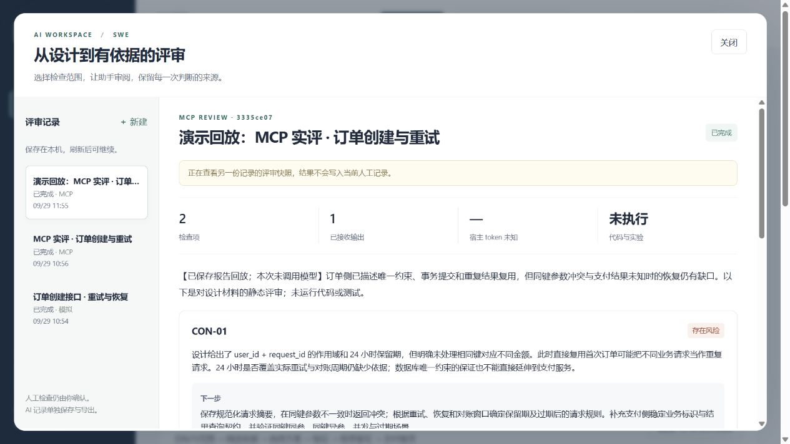

# AI Workspace · SWE 评审 MVP

[](https://github.com/kuoforever/ai-workspace-mvp/actions/workflows/ci.yml)

复用现有工程工作台，给设计评审增加一条可恢复、有来源的 AI 流程。Web 是首个客户端；MCP 连接宿主助手，后续原生 Android / iOS 共用 API。



## 启动

需要 Python 3.11–3.13 和 uv（验证版本：Python 3.12、uv 0.12.5）。Windows 在本目录运行 `./start.ps1`，打开 http://127.0.0.1:8765/?ai 。首次启动自动安装锁定依赖。

macOS / Linux：`uv sync --frozen` 后运行 `uv run --no-sync uvicorn app.api:app --host 127.0.0.1 --port 8765`。

无模型密钥也可演示：点击“填入示例”，评审方式选择“离线演示”，提交后查看、刷新或导出报告。少于 100 字符的演示材料会触发一次模拟澄清。

也可运行 `uv run --no-sync python scripts/replay_demo.py`，通过真实 MCP 回放仓库中的已保存报告。网页标题和摘要明确标记回放，本次不调用模型。[两分钟演示提纲](DEMO.md) 包含操作顺序和现场模型评审方式。

## 使用 MCP

1. 启动 Web 服务，保持终端运行。
2. 运行 `./connect-mcp.ps1` 将 `swe-workspace` 加入 Codex 的 MCP 配置；该脚本会修改用户 MCP 配置。相同配置重复运行不会修改；遇到不同的同名配置会停止。也可在 MCP 设置中使用下方命令手动连接。
3. 重载 MCP 服务；已有聊天是否立即加载新工具取决于宿主。必要时新开聊天。
4. 网页选 MCP 模式，提交设计。在连接此 MCP 的助手中说：“评审工作台中的待评审设计，完成后提交结果。”
5. 助手读取上下文，提交报告或最多三个问题；问题在网页回答后，请助手继续。页面自动刷新状态。

stdio 命令：`uv --directory <本项目绝对路径> run --frozen --no-sync python -m app.mcp_server`

MCP 工具：`get_check_catalog`、`start_review`、`list_pending_reviews`、`get_review_context`、`submit_review_output`。默认连接本机 `http://127.0.0.1:8765`，可通过 `AI_WORKSPACE_URL` 修改本机端口。

MCP 是资料和工具协议，模型由 Codex 等宿主提供。网页不会自动唤起聊天，本服务也没有独立模型 API 调用。宿主调用次数、token 和费用不可观测，保存为 `null`；三次上限约束的是向本服务提交结果的次数。没有使用 MCP sampling，也不假定宿主支持后台推理。本地 stdio 连接已设计用于桌面助手，ChatGPT 网页的远程连接需要另行部署和认证。

## 当前切片

- 249 项检查、33 类决策和 110 篇文档来自原 SWE 资产；原页面和人工记录规则保留。
- 设计最多 8,000 字符，选择 1–8 项检查；确定性检索只发送选定知识及有界相关片段。
- LangGraph + SQLite 持久化两类等待：宿主评审、用户回答；最多一轮澄清。
- 请求键去重，版本和输入摘要校验，结果提交最多三次。完成结果不可被后续输出覆盖。
- 验证每项检查覆盖、引用存在、原文片段和来源摘要；语义支持尚需人工评估。
- 重启保留待评审与待答状态。遗留运行中操作标记中断，不自动重放。
- 人工结果与 AI 报告分开。报告导出 Markdown / JSON，旧 HTML 导出不携带 AI 历史。

只运行一个 Web 服务进程、一个 worker，绑定 loopback。数据库在 `data/`，不会通过静态路由公开。页面和 MCP 写操作共享同一服务的串行校验。复制整个目录时，本地数据应由你决定是否一并携带，Git 默认忽略。

## 验证

```powershell
uv sync --frozen
uv run pytest -q
uv run ruff check app tests scripts evals
node --check static/ai-review-ui.js
uv run python -m evals.benchmark freeze
```

测试覆盖协议互通、报告保存、重复请求、版本冲突、引用伪造、检查覆盖、澄清恢复、提交上限和本机访问边界。协议测试自行启动隔离服务和 stdio MCP 客户端，不使用模型，不触碰日常数据库。

GitHub Actions 在 Windows / Ubuntu 的 Python 3.12 环境运行锁定安装、Lint、JavaScript 语法检查、冻结摘要校验和全部测试。若要验证当前 Git 提交在全新目录中的安装，运行 `uv run python scripts/verify_release.py --work-dir ../../work --out evidence/release-check.json`；脚本使用新虚拟环境，允许复用下载缓存。

`scripts/mcp_call.py` 是协议诊断客户端，不是自动推理循环。例如：`uv run python scripts/mcp_call.py list_pending_reviews`。真实模型质量不能用模拟测试通过数替代。

## 实现与复用

`app/api.py` 为 Web API，`review_service.py` 管固定图与状态，`store.py` 保存快照和命令去重，`knowledge.py` 管检索引用，`mcp_server.py` 是 stdio 适配器。`static/ai-review-ui.js` 增加页面面板。

状态流转与客户端边界见 [设计说明](docs/DESIGN.md)。

保留原 SWE UI 和内容；`knowledge/provenance.json` 记录源版本和 SHA-256。LangGraph 用法参考个人 [agent-crash-recovery-bench](https://github.com/kuoforever/agent-crash-recovery-bench) 的图/检查点/中断结构，新增评审节点与 Web/MCP 场景。PolicyFlow 只参考了输入契约、幂等及测试思路，没有搬入它的执行运行时，也没有借用历史测试结论。

框架依赖使用 [FastAPI](https://github.com/fastapi/fastapi)、[LangGraph](https://github.com/langchain-ai/langgraph)、[MCP Python SDK](https://github.com/modelcontextprotocol/python-sdk)。具体依赖版本见 `uv.lock`；MCP SDK 固定在 v1 系列，避免移植 v2 的额外成本。

完整复用边界和来源说明见 [ATTRIBUTION.md](ATTRIBUTION.md)。仓库保留原材料中的引用；目前未另行添加覆盖全部内容的开源许可。

## 固定样本与求职材料

[评测说明](evals/README.md) 包含 12 个冻结场景、两种输入配置和可重现工具。当前 MCP 同会话试跑已保存 8 份验收样本报告，17 条引用逐字匹配；这不是独立模型质量对照。应用及评测回归包含 24 项测试，最新安装验证见 [release-check.json](evidence/release-check.json)。

[简历表述与演示提纲](PORTFOLIO.md) 已整理，可按 AI 应用或全栈岗位选用。完整模型输出、协议回执和分项结果见 `evals/runs/pilot-mcp/`。

仍待交付：独立上下文的 direct/MCP 对照及人工语义评审、独立模型自动调用、云端账号与部署、Android / iOS 原生客户端。当前可展示的是个人本机 Web + MCP 应用，不能写成已上线多端产品。
