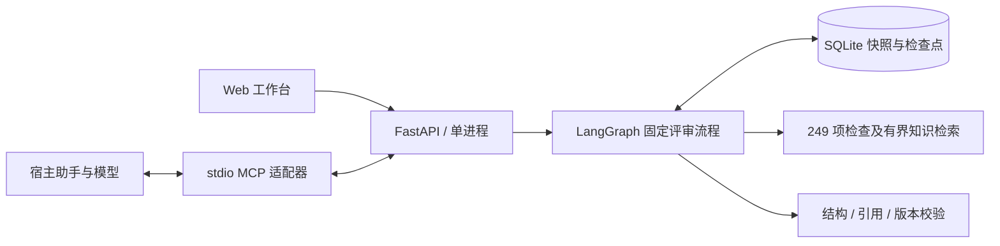
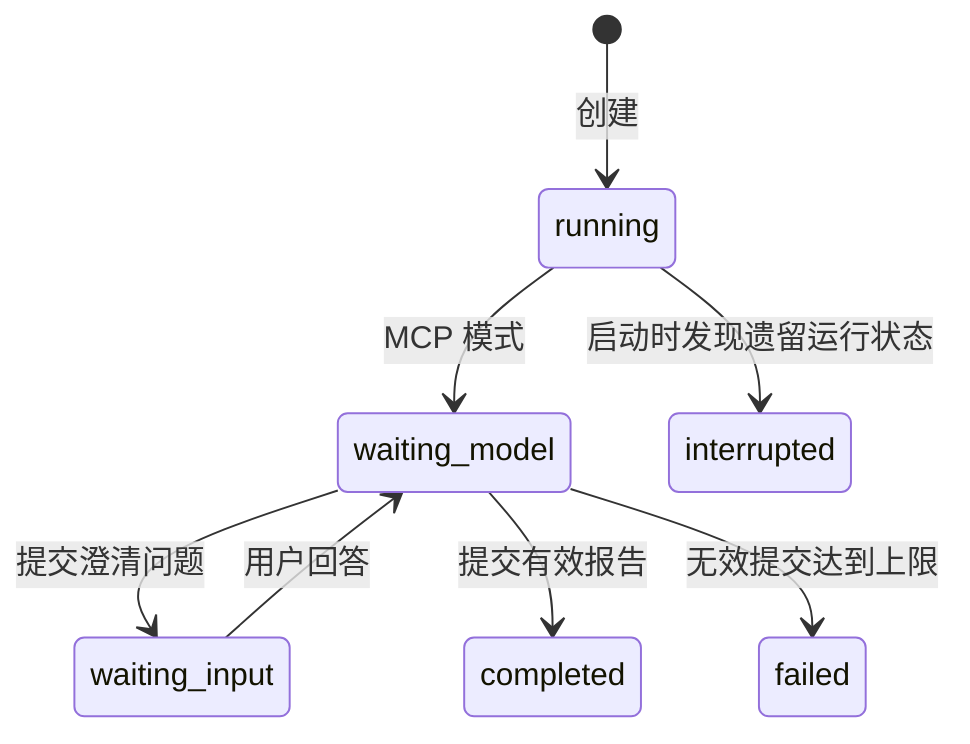

# 当前 MVP 设计

用户提交设计和检查范围，宿主助手通过 MCP 读取有界知识，提交问题或报告。Web 展示证据、保留状态并导出报告。

MCP 适配器没有第二份数据库，也不运行自主模型循环。Web 和 MCP 经同一个服务写入；桌面宿主提供推理，网页提交后需要在助手中触发处理。

## 状态和写入契约

图展示 MCP 的用户可见主路径，省略了每次处理期间短暂的 `running` 状态；离线模拟模式使用相同校验和持久化逻辑。

- 创建时冻结设计、检查项、记录 ID、输入 SHA-256、知识版本和来源摘要。
- 相同请求键和内容重放返回已存状态；相同键不同内容返回 409。
- 回答及报告须携带当前版本，模型输出还须匹配输入摘要。完成后不能被新结果覆盖。
- 一轮最多三个澄清问题；每份评审最多三次服务端结果提交尝试。宿主内部模型调用不在此预算中。
- 校验检查覆盖、来源存在、原文片段与来源摘要。`supported`、`risk`、`not_applicable` 还须引用用户设计或回答。字面匹配不等于语义判断正确。
- SQLite 保存应用快照和命令去重；LangGraph 保存等待节点。重启保留等待状态，不自动重发模型调用。

## 范围和取舍

首版复用既有 HTML，只新增独立 AI 面板，降低前端重写成本；249 项检查文本按选择范围检索，不把整份手册发送给模型。

当前单进程、单 worker、loopback 访问。进程锁串行化应用写入，不能据此宣称多实例一致性。引用与输出按文本显示，不执行设计材料中的代码。AI 报告独立于人工检查结果。

模型 token、费用和模型端延迟由宿主掌握；未知值保留 `null`。工程回归、同会话试跑、独立模型质量对照分别记录。

共享 API 已具备，原生 Android / iOS 客户端尚未实现。远程部署需要补认证、用户隔离和多实例数据层；独立 Web 自动推理需要另接模型提供方。这些不属于当前交付的运行能力。

实现入口：[`api.py`](../app/api.py)、[`review_service.py`](../app/review_service.py)、[`knowledge.py`](../app/knowledge.py)、[`mcp_server.py`](../app/mcp_server.py)。实际 HTTP 合约由 `/openapi.json` 生成，快照位于 [`evidence/openapi.json`](../evidence/openapi.json)。
