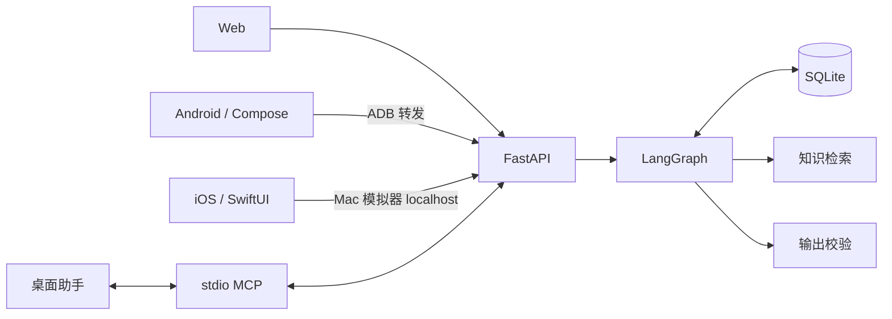
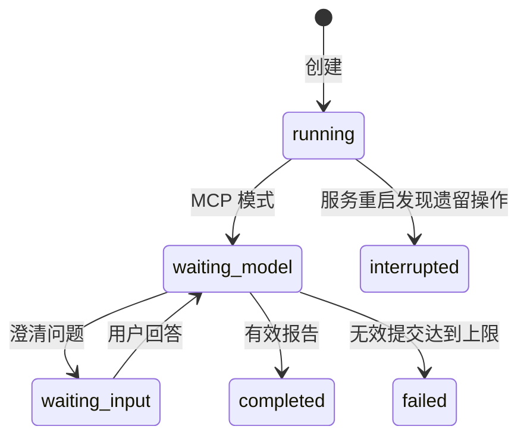

# 架构设计

各客户端通过 FastAPI 读写同一份评审状态。LangGraph 管理评审流程，SQLite 保存快照、请求回执和检查点；桌面助手通过 MCP 提供模型推理。

## 模块

| 模块 | 职责 |
|---|---|
| [`api.py`](../app/api.py) | HTTP 接口、输入校验、本机访问限制和报告导出 |
| [`review_service.py`](../app/review_service.py) | 评审状态流转和 LangGraph 节点 |
| [`store.py`](../app/store.py) | SQLite 快照、命令去重和版本检查 |
| [`knowledge.py`](../app/knowledge.py) | 按检查范围检索来源、构造有界上下文、校验引用 |
| [`mcp_server.py`](../app/mcp_server.py) | 将 MCP 工具调用转发到 HTTP 服务 |
| [`ai-review-ui.js`](../static/ai-review-ui.js) | Web 评审界面 |

运行中的 HTTP 合约见 `/openapi.json`，Swagger UI 位于 `/docs`。仓库保存了一份[合约快照](../evidence/openapi.json)。

## 评审状态

图中省略了每次处理期间短暂的 `running` 状态。每份评审最多进行一轮澄清，包含最多三个问题；服务端最多接受三次结果提交尝试。离线模式使用固定输出，沿用同一套校验与持久化逻辑。

## 数据一致性

- 创建时保存设计、检查项、记录 ID、输入 SHA-256 和来源快照。
- 相同幂等键与正文返回已保存结果；相同键配合不同正文返回 `409`。
- 回答和报告需要当前版本，模型输出还需匹配输入摘要。完成后的结果不可被覆盖。
- SQLite 保存应用状态和命令回执，LangGraph 保存等待节点。服务重启后保留待处理状态，将遗留的运行中操作标为中断。
- 人工检查结果与 AI 报告独立保存。

## 知识与引用

检索以用户选择的检查项为范围，提供相应检查卡和有界的手册、决策片段。结果提交时校验检查覆盖、来源存在、原文片段和摘要。`supported`、`risk`、`not_applicable` 结论还需引用用户设计或回答。

引用校验判断文本来源及结构有效性；语义支持由人工评审或独立评测判断。设计材料按文本处理，应用不执行其中的代码或指令。

## 移动端恢复

Android 使用 ViewModel，SharedPreferences 保存草稿和缓存，提交日志使用 AtomicFile；iOS 使用 MainActor 状态对象与 Codable 原子文件。两端使用串行后台执行器完成全部设备存储读取和写入，保存草稿、回答、最近 20 份记录，以及提交前的请求键和原始正文。

编辑先更新内存中的输入，再排队保存；同一输入的旧排队快照可被最新快照取代。界面明确区分正在保存、已保存和保存失败。提交等待队列完成并重试未保存的最新输入；失败时不发送新请求。网络请求的日志仍必须落盘后才能发送，网络结果与本机结果持久化后才能清除日志。意外退出时未完成的输入写入不能被保证恢复。

系统文件导入限 UTF-8 文本与 Markdown（10–8,000 字符、32 KiB）；选择取消或格式校验失败保留草稿。导入复制原文，引用定位在保存的来源快照中计算，不依赖外部文件或联网。已保存记录可离线阅读引用、生成 Markdown 并分享；旧的单报告缓存保持兼容。

| 结果 | 客户端行为 |
|---|---|
| 成功并取得有效响应 | 先保存本机结果，再清除待确认请求；本机写入失败时保留原请求 |
| 网络中断、5xx、无效响应 | 保留原请求，用户可重试 |
| 明确的 4xx 拒绝 | 结束本次命令，保留输入；409 提示刷新 |
| 提交日志损坏 | 暂停写入并提示错误 |

应用重新打开时不自动发送未确认请求。前台等待助手时轮询；编辑回答、进入后台或发生连接错误时停止自动刷新。恢复测试覆盖进程重启和文件写入失败，不覆盖设备断电。

连接状态与评审状态分别展示：HTTP 连通不代表桌面助手已开始推理；检查连接仅请求 `/api/config`，不会重放待确认操作。

## 部署约束

后端以单进程、单 worker 运行，绑定回环地址，通过进程锁串行化写操作。MCP 适配器使用该服务，不持有独立数据库。

模型推理由桌面宿主触发；本服务没有独立模型调用循环。宿主调用次数、token、费用和模型延迟不可观测，记录为 `null`。三次提交限制只约束结果接口。

远程部署需要增加认证、用户隔离和支持多实例的数据层。移动端当前连接方式见 [Android](../android/README.md) 和 [iOS](../ios/README.md)。
