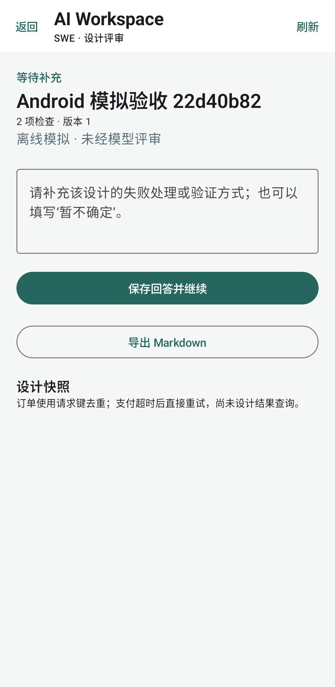
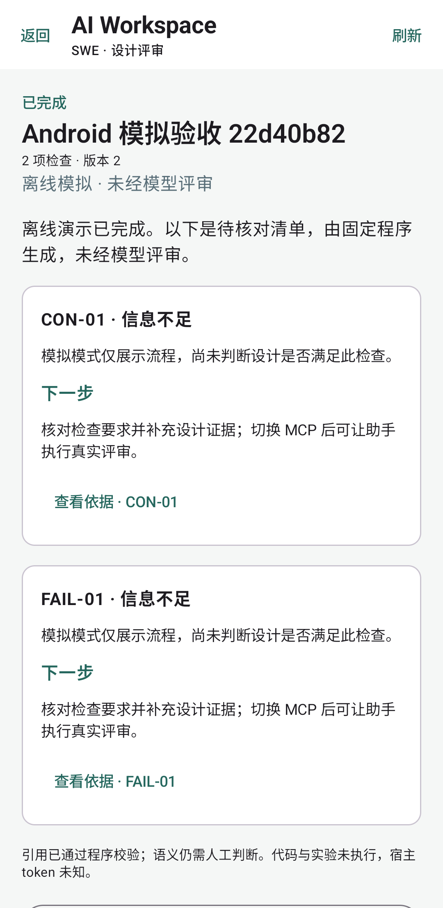
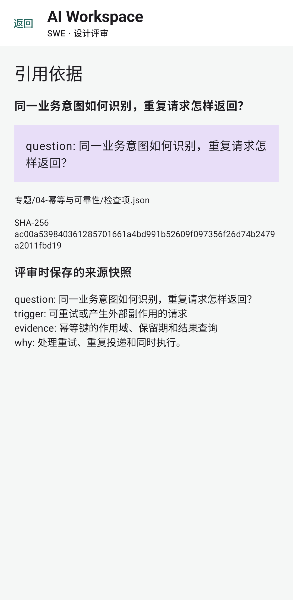
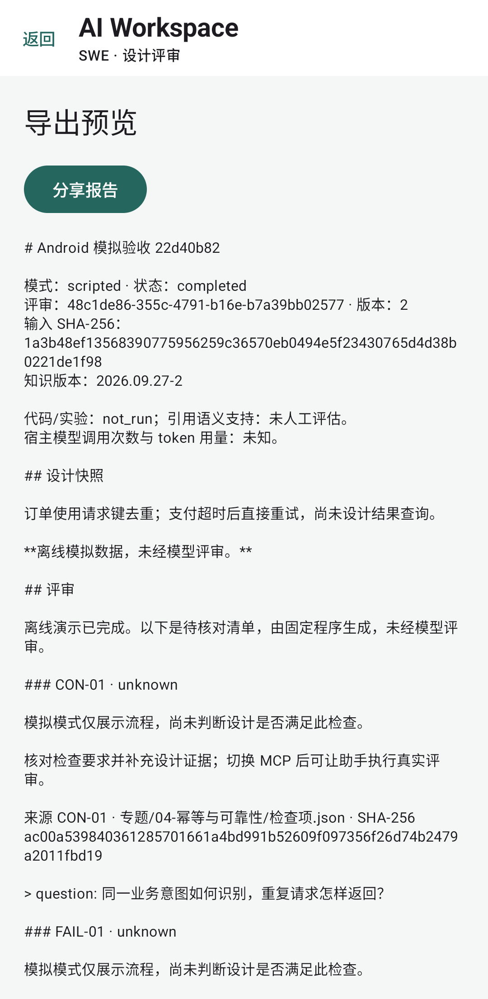
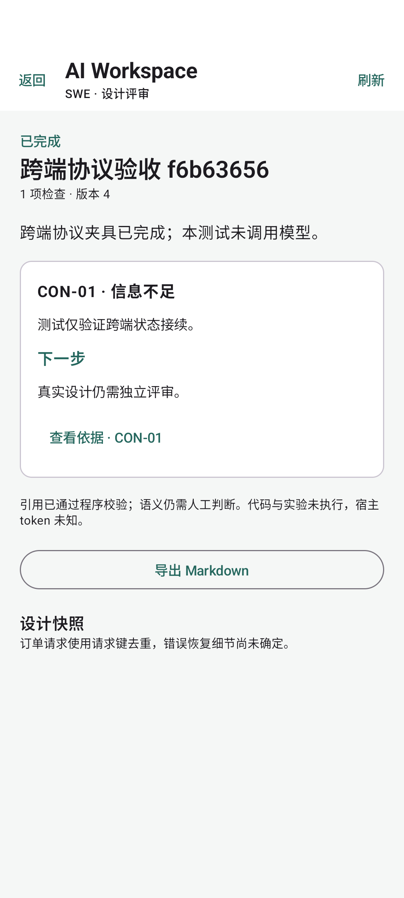

# Android 原生端验收

2026-09-29，在 Ubuntu GitHub Actions 上构建 APK，并连接隔离的真实 FastAPI 服务完成 Android 15（API 35、x86_64、Pixel 6 配置）模拟器验收。

本页与 JSON 保留当时 Android 交付的范围；后续完成的 iOS 验收单独见 [iOS 证据](../ios/README.md)。

- [构建、5 项单元测试、Lint 与 2 条模拟器流程](https://github.com/kuoforever/ai-workspace-mvp/actions/runs/36549563579)：测试源码提交 `538aa3ca25b791eeda16bdbbff5c46e71b488d66`。
- [共享后端 Windows / Ubuntu CI](https://github.com/kuoforever/ai-workspace-mvp/actions/runs/36549563596)：同一提交，每个平台 24 项自动化测试。
- [机器可读验收记录](verification.json)：构建提交、运行环境、测试数量、APK 与录屏 SHA-256。
- [模拟器原始结果](device-tests.xml)、[单元测试统计](unit-tests.json)、[Lint 输出](lint-results.txt)。完整原始报告随对应 CI artifact 保存。
- [Android 预览版下载](https://github.com/kuoforever/ai-workspace-mvp/releases/tag/android-v0.2.0)：Debug APK、自动录屏与校验文件。

第一条流程使用原生界面创建评审、填写澄清，并验证 Activity 重建保留输入，随后查看来源和导出 Markdown。第二条流程通过 HTTP 夹具模拟电脑创建和助手提交，手机回答后自动显示电脑提交的最终报告。测试确认服务端只保存一条对应创建记录和实际回答。

这些是客户端和协议验收，未调用模型，不计入模型质量评测。设备草稿、写入前持久化及未知结果重试的故障路径由单元测试补充验证。尚无实体手机、远程认证、应用商店发布或 iOS 验收。

## 真实模拟器画面

以下截图来自测试应用的已渲染 Compose 画面；未经美化或内容编辑。

| 澄清回答 | 完成报告 |
|---|---|
|  |  |

| 来源快照 | 导出预览 |
|---|---|
|  |  |

录屏为整个测试过程的自动原始录制，包含启动等待，没有讲解音轨。早期 CI 失败涉及断言匹配、截图随应用卸载删除、录屏存储权限与一次设备断连；对应修复保留在 Git 历史，以上链接指向后续通过的验收运行。
