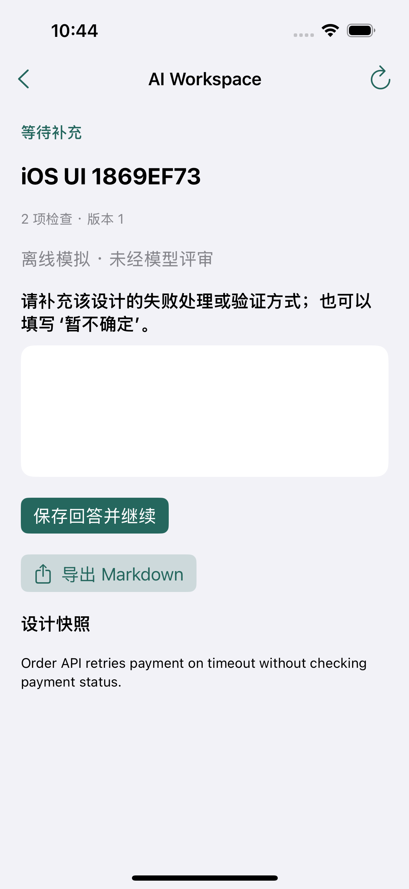
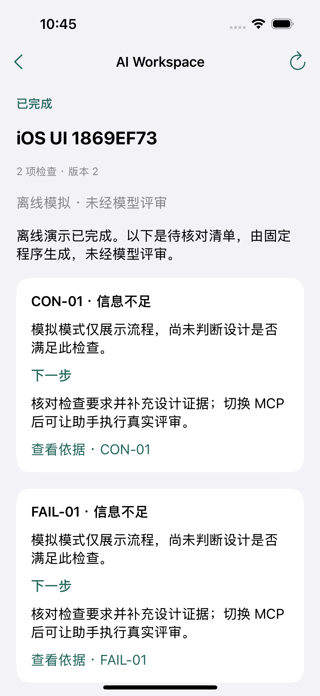
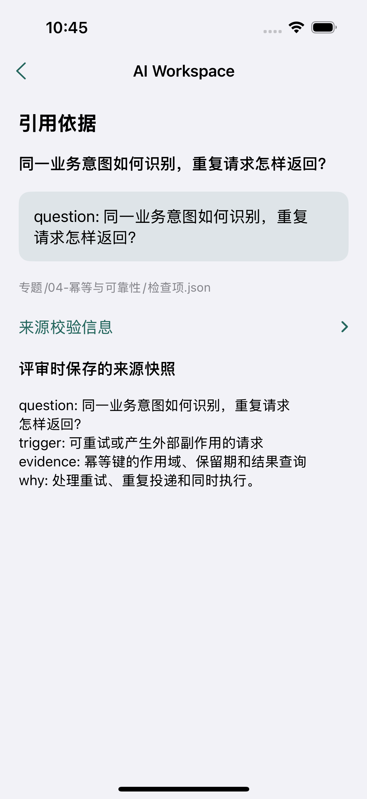
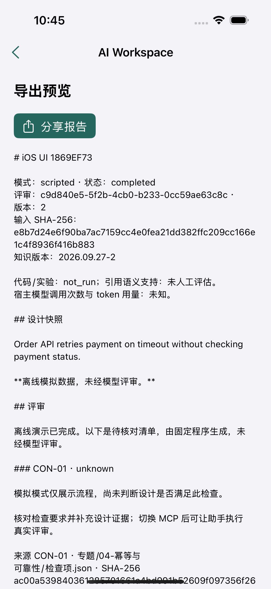
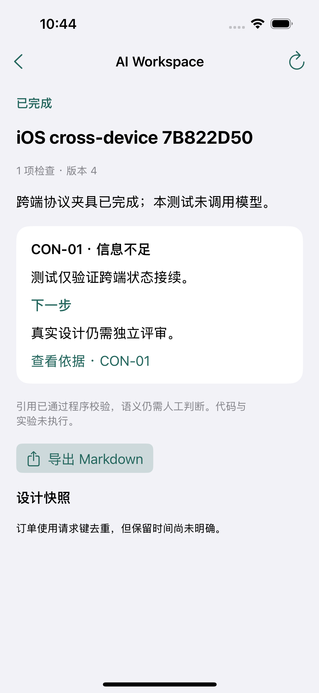

# iOS 测试报告

| 项目 | 记录 |
|---|---|
| 日期 | 2026-09-29 |
| 环境 | macOS 15.7.9、Xcode 16.4、iPhone 16 / iOS 18.5 arm64 模拟器 |
| 源码 | `cad60a4356b174c4496192685277a273f921a13a` |
| 结果 | 构建、7 项单元测试和 2 条界面流程通过，0 失败、0 跳过 |
| CI | [36556546790](https://github.com/kuoforever/ai-workspace-mvp/actions/runs/36556546790) |
| 发布 | `ios-v0.3.0`；原生 Bundle 版本 `1.0 (1)` |

## 覆盖范围

- 新建评审，重启后恢复创建草稿与澄清回答，提交并核对服务端记录。
- 阅读报告和来源快照，检查 Markdown 预览与分享入口。
- 电脑端 HTTP 夹具创建评审与提交问题，手机回答后自动显示最终报告。
- 单元测试覆盖丢失回复、原请求恢复、写入失败、409 / 503、损坏响应与损坏日志。

界面测试连接隔离的 FastAPI 服务，使用模拟数据和协议夹具。应用包包含 arm64 / x86_64，本次运行测试的是 arm64。真机签名、外部分享接收方和远程认证未纳入测试。

## 文件

[验证摘要](verification.json) · [Xcode 汇总](test-summary.json) · [测试日志](tests.log) · [模拟器应用与录屏](https://github.com/kuoforever/ai-workspace-mvp/releases/tag/ios-v0.3.0)

完整 `.xcresult`、构建日志和附件保存在对应 CI artifact 中。安装方法见 [iOS README](../../ios/README.md)。原始录屏约 5:48，包含测试准备等待，可从约 3:50 查看界面操作；无讲解音轨。

## 截图

| 澄清回答 | 完成报告 |
|---|---|
|  |  |

| 引用依据 | 导出预览 |
|---|---|
|  |  |

