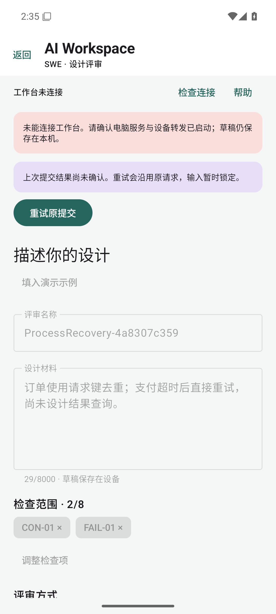
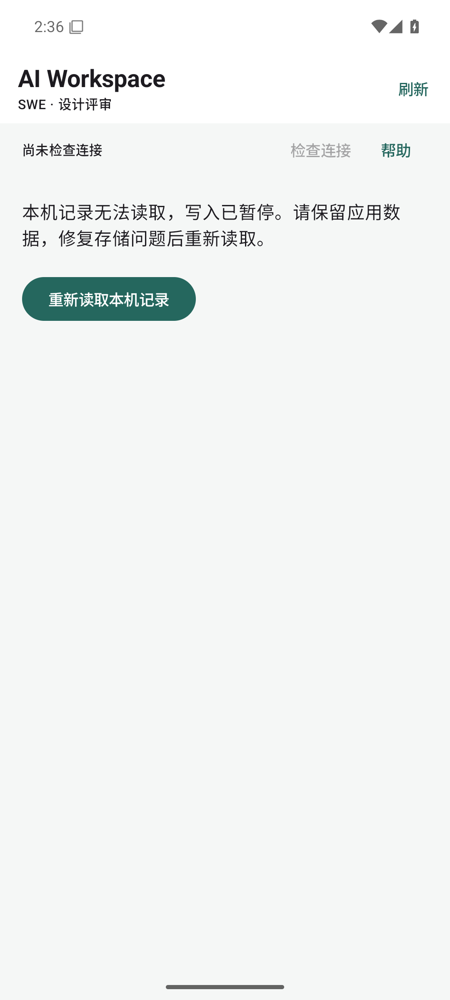
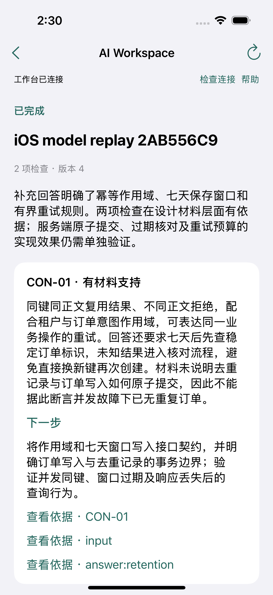

# 移动端恢复与 MCP 集成

此轮增加连接检查、助手处理指令，以及本机结果保存失败时的原请求恢复。Android 增加启动记录损坏处理和进程外恢复检查。

后续的深色模式、大字体、横竖屏与宽窗口检查见[界面适配报告](adaptation/README.md)。下方保留本次恢复与 MCP 集成的原始记录。

## 检查结果

| 范围 | 结果 | 运行 |
|---|---|---|
| Android | 9 项单元测试、2 条界面流程、6 项进程外检查通过 | [Android 15 / API 35](https://github.com/kuoforever/ai-workspace-mvp/actions/runs/36583017810) |
| iOS | 10 项单元测试、2 条界面流程通过，0 失败、0 跳过 | [iPhone 16 / iOS 18.5](https://github.com/kuoforever/ai-workspace-mvp/actions/runs/36582271384) |
| 后端与协议 | Windows / Ubuntu 各 24 项测试通过 | [CI](https://github.com/kuoforever/ai-workspace-mvp/actions/runs/36583017834) |

[构建与校验摘要](verification.json)记录各平台对应源码提交和安装包 SHA-256；[Android 进程检查](android-process-recovery.json)、[设备测试 XML](android-ui-tests.xml)和 [Xcode 汇总](ios-test-summary.json)保存原始结果。构建产物也保存在对应运行的 CI artifact 中。

## MCP 生成记录

2026-09-29，桌面 AI 助手通过已连接的 `swe-workspace` MCP 工具，完成两项检查的一轮澄清与最终报告。后端使用隔离数据目录。问题和结论由本次助手生成，回答使用演示数据并经 HTTP 提交。

- [初始材料](mcp-live/create-input.json)与[首次上下文](mcp-live/context-before.json)。
- [澄清问题](mcp-live/questions.json)、[回执](mcp-live/questions-receipt.json)与[演示回答](mcp-live/demo-answers.json)。
- [补充后的上下文](mcp-live/context-after.json)、[最终提交](mcp-live/report-submission.json)与[回执](mcp-live/report-receipt.json)。
- [报告](mcp-live/report.md)及[完整 JSON](mcp-live/report.json)。

最终状态 `completed`，两次模型结果提交均被接受，6 条引用通过后端校验。模型版本、token、费用和推理延迟未从宿主取得，不作估算。此样本验证协议与来源保存，不是盲测或模型质量统计。

## 原生测试

两端使用[共同样本](../../fixtures/mobile-review.json)在新建记录上回放问题与报告，通过原生界面填写回答并验证导出。CI 内没有模型调用；本机 MCP 生成和模拟器回放为两段验证，尚未完成设备与桌面助手之间的实时联调。

Android 的进程外检查使用实际 UI、应用私有文件、进程 ID 和服务端记录，覆盖草稿重启、断网提交重启、只读连接检查、原请求重试、回答重启和损坏日志恢复。每次强制结束后确认旧进程不存在，并核对新的进程 ID。

## 截图

| Android：断网原请求恢复 | Android：损坏记录处理 |
|---|---|
|  |  |

