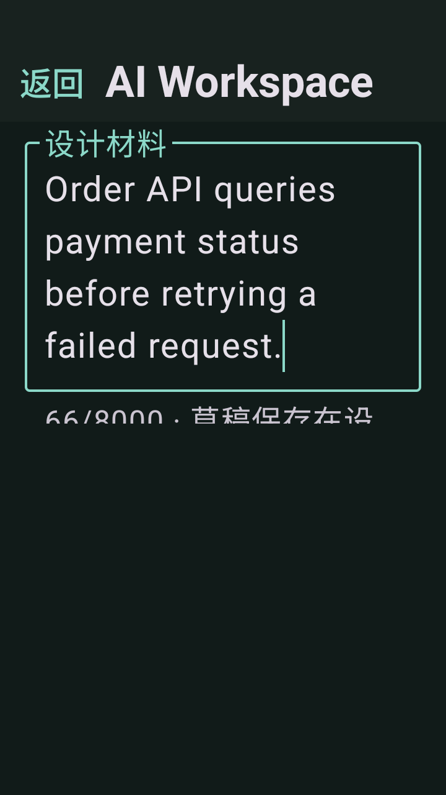
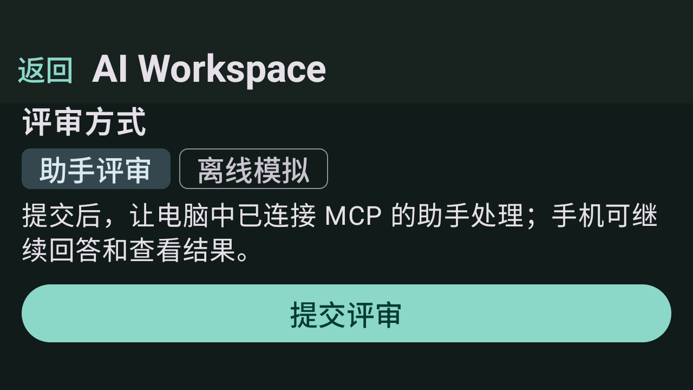
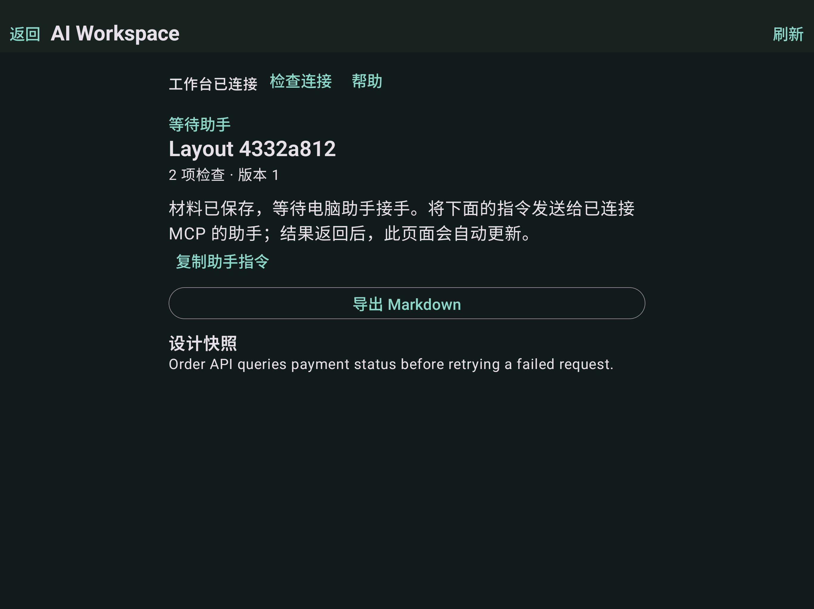
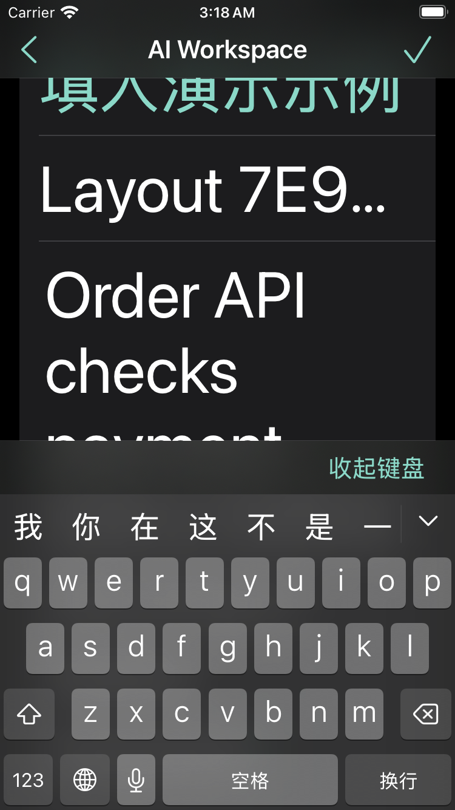
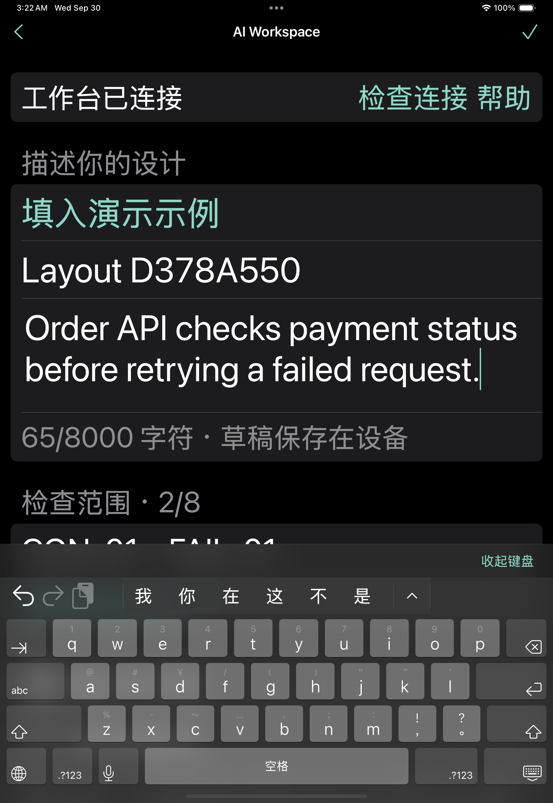

# 移动端界面适配

Android 跟随系统深色模式和字号，处理键盘与系统边缘，并在宽窗口中限制正文宽度。iOS 支持 iPhone / iPad、横竖屏、Dynamic Type 与深色配色；创建页提交入口固定在导航栏，大字体下使用可换行的评审方式选项。

## 验证结果

| 平台 | 检查 | 结果 |
|---|---|---|
| Android 15 / API 35 | 9 项单元测试、3 条界面流程、6 项进程外恢复检查 | 全部通过 |
| iPhone 16 / iOS 18.5 | 10 项单元测试、3 条界面流程 | 全部通过 |
| iPhone SE（第三代）/ iOS 18.5 | 深色模式、最大辅助功能字体、键盘输入与旋转后提交 | 通过 |
| iPad Pro 11-inch（M4）/ iOS 18.5 | 深色模式、最大辅助功能字体、旋转后输入与正文宽度 | 通过 |

Android 适配用例将隔离模拟器调整为 360 dp 宽度与两倍字体，再旋转并扩大窗口，验证原输入保留、提交成功和正文最大宽度 840 dp。宽窗口测试使用模拟器分辨率覆盖，不是 Android 平板真机测试。iOS 正文最大宽度为 840 pt；检查通过界面输入、可操作性、窗口尺寸及服务端单条记录断言完成。

[校验摘要](verification.json)保存运行链接、对应源码提交、设备信息、安装包 SHA-256 和截图摘要。原始结果见 [Android 界面测试](android-ui-tests.xml)、[进程恢复](android-process-recovery.json)、[iPhone 16](ios-iphone16-summary.json)、[小尺寸 iPhone](ios-compact-summary.json)和 [iPad](ios-tablet-summary.json)。

- [Android 运行](https://github.com/kuoforever/ai-workspace-mvp/actions/runs/36658408928)
- [iOS 运行](https://github.com/kuoforever/ai-workspace-mvp/actions/runs/36662906207)
- [Windows / Ubuntu 后端回归](https://github.com/kuoforever/ai-workspace-mvp/actions/runs/36662906201)：各 24 项测试通过。

此轮不调用模型。原有报告流程使用固定程序或已保存模型结果；真实 MCP 记录见[移动端集成报告](../README.md)。真机、其他系统版本、厂商窗口行为和实际外部分享接收仍未验证。

## 截图

| Android：小屏输入 | Android：横屏提交 |
|---|---|
|  |  |

| iPhone SE：最大字体 | iPad：最大字体 |
|---|---|
|  |  |

Android 截图只包含应用绘制层，键盘显示由系统窗口信息断言。iOS 横屏窗口截图存在裁剪问题，不用于视觉判定；旋转后的功能与宽度检查由自动化断言验证，原始图像摘要仍保留在校验记录中。
