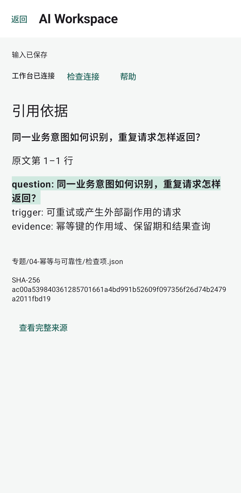
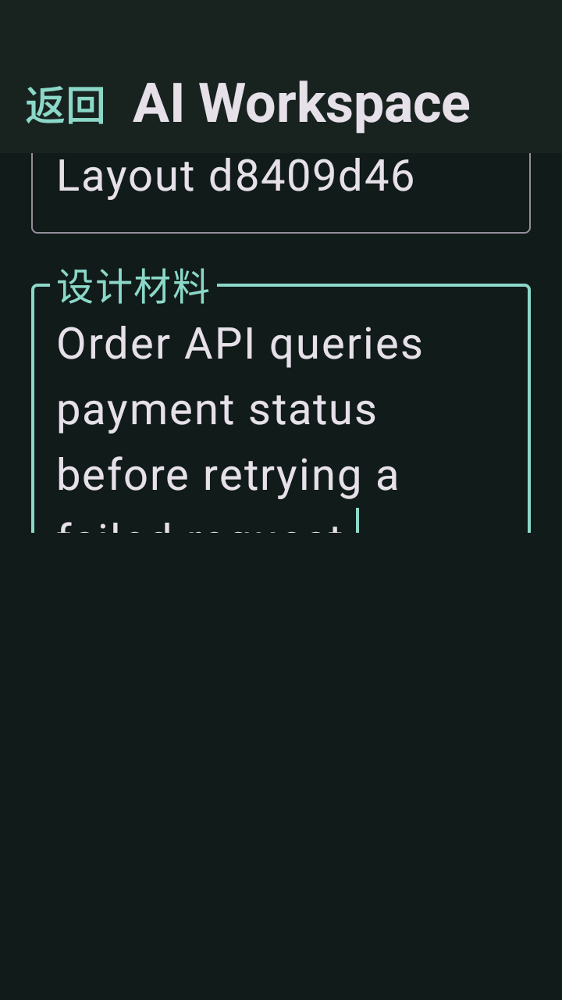
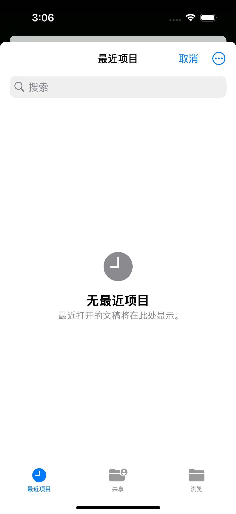
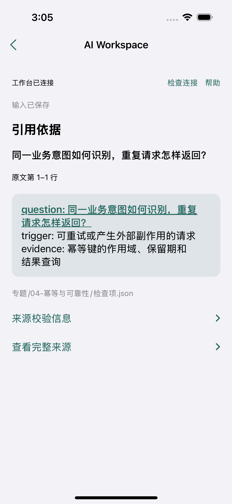
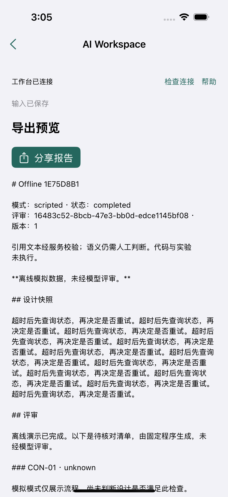

# 文件导入、离线阅读与后台保存

移动端增加系统 Markdown / 文本导入、带行号与上下文的引用阅读，以及最近 20 份评审的设备缓存。Markdown 分享从当前快照生成，可离线使用。旧的单报告缓存保持兼容。

草稿和回答先更新界面，再由串行后台队列保存。失败时保留最新输入并提供重试；提交、刷新详情和重新打开记录先等待输入保存，避免丢失新回答。待确认请求继续使用原幂等键与正文，网络结果和本机结果保存后才清除日志。

## 检查结果

| 范围 | 结果 | 环境与记录 |
|---|---|---|
| 后端 | 24 项测试通过，Ruff 通过 | Windows / Ubuntu，Python 3.12 · [CI](https://github.com/kuoforever/ai-workspace-mvp/actions/runs/36957786983) |
| Android | 22 项单元测试、5 项设备测试、6 项进程外检查通过；构建与 Lint 通过 | Android 15 / API 35 · [CI](https://github.com/kuoforever/ai-workspace-mvp/actions/runs/36954740886) |
| iOS | 20 项单元测试、5 条界面流程通过；小屏和平板各 1 项补充检查通过 | iPhone 16、iPhone SE、iPad / iOS 18.5 · [CI](https://github.com/kuoforever/ai-workspace-mvp/actions/runs/36957786953) |

覆盖的主要场景：

- UTF-8、BOM、Markdown、CRLF 与 Unicode 字符边界；编码错误、非法文件与过大文件保留原草稿。
- Android 实际系统选择器选中 Downloads 中的 Markdown，保存后重建 Activity 恢复文本。iOS 检查本地文件读取及系统选择器取消流程。
- 引用在原文中精确匹配、计算多行位置并保留前后文；缺失引用返回明确结果。
- 单报告缓存迁移、多报告重载及最近 20 份上限；离线测试中读取与导出不发送 HTTP 请求。
- 写入在后台线程执行；快速编辑与慢存储保持最新输入；草稿和回答保存失败阻止新提交，修复存储后重试保存。
- 进程外检查确认 Android 草稿、回答和未确认请求跨进程恢复，连接检查不重发请求，重试只创建一份记录，损坏日志保留并暂停写入。

## 截图

Android 引用定位与上下文：

Android 输入保存状态：

iOS 系统选择器与离线引用阅读：

## 复现与范围

构建和测试入口见 [Android 文档](../../../android/README.md) 与 [iOS 文档](../../../ios/README.md)。Android 进程外记录见 [android-process-verification.json](android-process-verification.json)。源码、测试摘要与产物摘要记录在 [verification.json](verification.json)；iOS 原始摘要见 [单元与界面检查](ios-unit-and-ui-summary.json)、[小屏](ios-compact-summary.json)和[平板](ios-tablet-summary.json)。

导入支持 UTF-8 的 .md、.markdown、.txt，材料为 10–8,000 个 Unicode 字符，读取限 32 KiB。应用意外结束前仍处于“正在保存输入”的更改可能尚未落盘。测试在隔离模拟器中运行；模型内容使用固定程序及已保存输出回放，未调用模型。真机、设备断电与其他系统版本需要单独验证。
