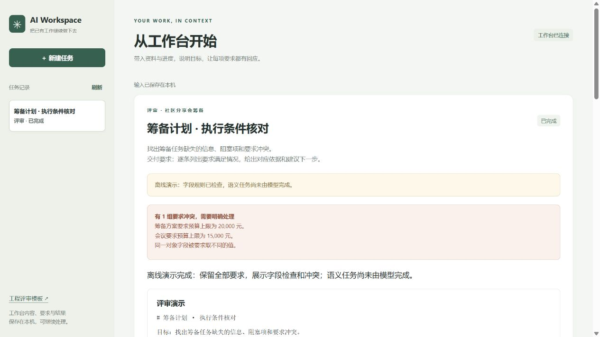
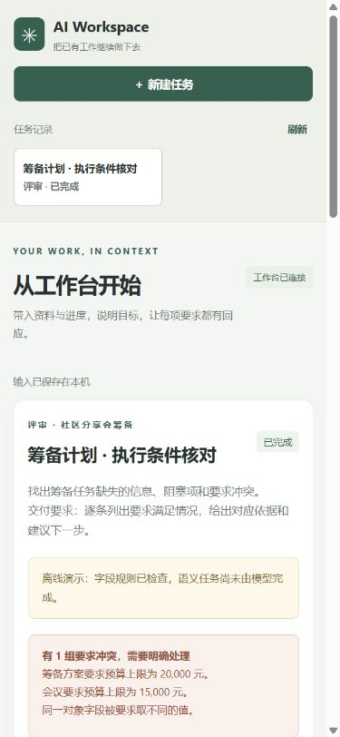

# 通用工作台验证

日期：2026-10-05。代码、测试与本记录保存在同一提交中。

## 本机验证

Windows 本机完成：

- `uv sync --frozen --offline`：锁定依赖可安装。
- `uv run --no-sync ruff check app tests scripts evals`：通过。
- `node --check static/ai-review-ui.js` 和 `node --check static/workspace.js`：通过。
- `uv run --no-sync pytest -q`：73 项通过，含真实 stdio MCP 的工程评审与通用任务闭环。
- `npm test`：27 项通过，覆盖输入、重试恢复、保存失败、迟到响应、离线读取、要求和引用的页面呈现。
- `uv run --no-sync python -m evals.benchmark freeze`：原工程评测协议摘要仍为 `a915fdffa0fc1d30ac37ae519968892a0cb9ce25059ffd3a62cec8896a88f938`。

关键输入测试使用完整工程 HTML / JSON 与非工程活动筹备工作台。测试验证不完整业务记录可以接入、所有要求都需要结论、确定性字段结果不能被覆盖、缺失及伪造引用被拒绝、冲突被保留、修改生成新版本且不能破坏已满足的必须要求。

## 实际页面

在运行的本机服务中载入 `fixtures/event-workbench.json`，选择“离线演示”，提交评审任务并查看结果。页面显示预算要求的冲突、负责人及完成状态的字段问题，并明确标示语义任务未由模型完成。

桌面截图：

390 × 844 视口截图：

手机宽度下读取 DOM 几何信息：视口宽度 390，页面滚动宽度 375；内容没有越出左右边界。

## 验证范围

这些检查验证接入规则、任务协议、引用、保存恢复、版本应用和页面流程。固定离线演示不是独立语义质量评测，没有测量模型费用、token、质量或宿主实际调用次数。

Android / iOS 的通用入口打开响应式 Web；原生工程评审仍保留。原生编译与测试通过拉取请求中的 Android / iOS 检查验证，本记录不冒充本机设备测试。
